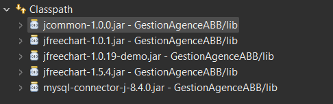

# GestionAgenceABB

- Clone the repository, next open Eclipse

- File > Open Project from File System

- Choose the project's folder "GestionAgenceABB" then Finish

- Wait till the libraries are fully downloaded

- In case they are not, right click on project's name

- Build Path > Configure Build Path

- Go to "Libraries" section, Click on Classpath

- Then On the right, Click on Add JARs

- Choose the "GestionAgenceABB" folder then "lib" folder

- Select the first .jar folder then OK

- Re-do the same for the next .jar files untill u will have something like that :

- Apply and Close

Execute the program !

 
